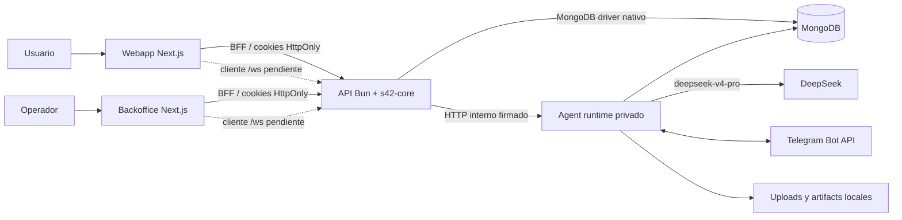
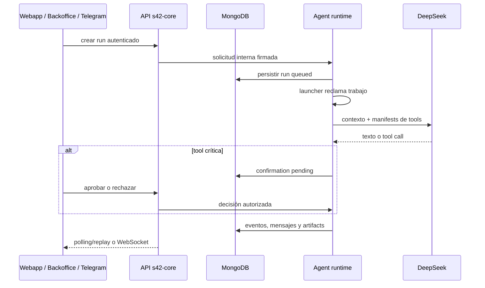

# Stock42 Agentic Monorepo

Scaffold Bun-first para construir productos SaaS multi-tenant con agentes de IA.
En un único monorepo reúne la experiencia de usuario, el backoffice operativo,
una API segura con tiempo real y un runtime agéntico durable capaz de ejecutar
tools, pedir confirmaciones, generar archivos y operar por Telegram.

No es una demo de chat ni un conjunto de carpetas vacío: entrega una vertical
funcional sobre la que un equipo puede crear un producto, manteniendo separados
el plano público, el plano administrativo y la ejecución privada del agente.

> **Estado:** candidato a publicación pública. El scaffold está implementado,
> pero aún existen decisiones de licencia y gates P0 abiertos. Antes de usarlo
> como base pública, consulta [Preparación para publicación](./docs/PUBLICATION.md)
> y el backlog técnico [Stock42 New Era](./NEWERA.md).

## Qué problema resuelve

Crear un producto agéntico real exige bastante más que conectar una interfaz a
un LLM. Hay que resolver identidad, tenancy, contratos, persistencia, ejecución
durable, tools, autorizaciones, observabilidad, archivos, tiempo real y una
superficie desde la que operar el sistema.

Este monorepo entrega esa base integrada:

- **Webapp:** aplicación Next.js para el usuario final, autenticada y aislada
  por tenant.
- **Backoffice:** control de plataforma, tenants, personas, runs, approvals y
  accesos de Telegram.
- **API:** servicio Bun con `s42-core`, MongoDB, auth, RBAC, auditoría, archivos
  y WebSocket nativo.
- **Agent runtime:** servicio privado con DeepSeek, cola durable, procesos
  aislados, supervisor, tools, confirmations, artifacts y Telegram.
- **Paquetes compartidos:** contratos Zod, cliente API, sistema UI shadcn,
  TypeScript y ESLint.
- **Operación:** Turborepo, launchers explícitos, CI, Playwright y virtual hosts
  Nginx independientes.

## Arquitectura



El navegador nunca recibe tokens de servicios internos ni habla directamente
con MongoDB, DeepSeek o el runtime del agente. Las aplicaciones Next.js exponen
Route Handlers explícitos como BFF; la API concentra identidad, autorización y
tenancy; el agente permanece sin virtual host público.

### Flujo de un run agéntico



Cada run tiene estado durable. El launcher limita concurrencia global y por
tenant, cada ejecución vive en un proceso hijo y el supervisor detecta
heartbeats vencidos, timeouts y cancelaciones. Los reinicios no dependen de la
memoria de un único proceso.

## Cobertura funcional actual

| Superficie          | Incluye                                                                                                                                                 |
| ------------------- | ------------------------------------------------------------------------------------------------------------------------------------------------------- |
| Identidad y tenancy | Administrador de plataforma idempotente, tenants, personas, roles `platform_admin`, `tenant_owner`, `operator` y `user`                                 |
| Autenticación       | Access/refresh por cookies HttpOnly, rotación de refresh, CSRF ligado a sesión, CORS y rate limiting                                                    |
| API                 | Módulos por capacidad, contratos Zod, documentos MongoDB planos, Models y storages delgados, boot e índices idempotentes                                |
| Tiempo real         | `/ws` sobre `WebSocketController`/`WebSocketControllers` nativos de `s42-core`, ticket de un uso, aislamiento por tenant, heartbeat y replay            |
| Webapp              | Login tenant-aware, sesión BFF y creación de runs desde una experiencia Next.js para usuario final                                                      |
| Backoffice          | Login de plataforma/tenant, gestión de tenants y personas, panel de agente, polling de eventos, cancelaciones, confirmations y CRUD de accesos Telegram |
| Runtime agéntico    | Cola durable, launcher, procesos aislados, supervisor, reintentos, idempotencia, cancelación y modelo `deepseek-v4-pro`                                 |
| Tools               | Contexto y fecha, inspección de uploads, generación CSV/PDF, listado de artifacts y envío crítico a Telegram con confirmación                           |
| Archivos            | Uploads y artifacts con metadata en MongoDB, bytes fuera de la base y descarga autorizada                                                               |
| Telegram            | `getUpdates` opt-in en desarrollo, bindings administrados por servidor, conversaciones por chat, comandos de estado/cancelación y entrega de respuestas |
| Calidad             | Unit tests con `bun:test`, integración API opt-in, E2E desktop/mobile con Playwright, boundaries y pipeline CI                                          |

### Límites deliberados

- La API y el agente ejecutan TypeScript directamente con Bun; sus scripts
  `build` son no-op exitosos. Solo se compilan `webapp` y `backoffice`.
- MongoDB es la única base de datos. Los tests usan exclusivamente una base
  existente y autorizada; nunca crean otra base ni ejecutan `dropDatabase`.
- No hay tools MongoDB genéricas expuestas al LLM. Cada capacidad debe tener
  contrato, scope, autorización e idempotencia explícitos.
- El agente usa DeepSeek por defecto y el modelo configurado es
  `deepseek-v4-pro`.
- Los uploads y artifacts usan filesystem local en esta etapa; object storage
  y operación multi-instancia pertenecen a la evolución P3.
- La interfaz actual de la webapp crea runs, pero todavía debe completar la
  experiencia de seguimiento y respuesta. El backoffice consume eventos por
  polling HTTP aunque el gateway WebSocket ya existe. Estos trabajos están
  definidos en [NEWERA.md](./NEWERA.md).

## Stack técnico

| Capa                      | Tecnología                                                 |
| ------------------------- | ---------------------------------------------------------- |
| Runtime y package manager | Bun 1.3.14 o superior                                      |
| Monorepo                  | Bun workspaces + Turborepo 2.10                            |
| Lenguaje                  | TypeScript 5.9                                             |
| Web                       | Next.js 16, React 19, App Router, Tailwind CSS 4           |
| UI                        | shadcn 4 `base-nova`, Base UI y componentes compartidos    |
| API                       | `s42-core` 3.0.13 sobre un listener `Bun.serve` compartido |
| Tiempo real               | WebSocket nativo de `s42-core`/Bun                         |
| Persistencia              | MongoDB 6 driver, sin ORM                                  |
| Contratos                 | Zod 4 compartido end-to-end                                |
| IA                        | DeepSeek `deepseek-v4-pro` con tool calls                  |
| Testing                   | `bun:test` + Playwright                                    |
| Edge                      | Virtual hosts Nginx autónomos                              |

Las versiones comunes viven en el `catalog` raíz. Todos los packages están
marcados como `private` para impedir una publicación accidental en npm; esto no
impide que el repositorio Git sea público.

## Estructura del repositorio

```text
.
├── apps/
│   ├── webapp/          # producto para el usuario final
│   ├── backoffice/      # administración y operación
│   ├── api/             # HTTP, auth, MongoDB y WebSocket
│   └── agent/           # runtime durable privado y Telegram
├── packages/
│   ├── contracts/       # schemas Zod y tipos compartidos
│   ├── api-client/      # transporte tipado browser/server
│   ├── ui/              # catálogo shadcn base-nova compartido
│   ├── typescript-config/
│   └── eslint-config/
├── docs/                # arquitectura y guías por superficie
├── nginx/               # virtual hosts copiables individualmente
├── scripts/             # configuración y control de boundaries
├── build-all.sh
├── run-all.sh
└── run-dev-all.sh
```

Las apps no importan código fuente de otras apps. Todo contrato o código
reutilizable vive en `packages/*`, y los paquetes compartidos tampoco importan
apps. Los Route Handlers de Next.js son explícitos: no se usan catch-all API
routes.

## Inicio rápido

### Requisitos

- [Bun](https://bun.sh/) `>=1.3.14`.
- Una instancia MongoDB accesible y una base **ya existente**.
- Una API key de DeepSeek para ejecutar runs reales.
- Un token de Telegram solo si se habilitará esa integración.

Nginx y Playwright son opcionales para el primer arranque local.

### 1. Obtener e instalar

Cuando el repositorio público esté marcado como template, la vía recomendada
será **Use this template** para iniciar un repositorio nuevo sin heredar el
historial del scaffold. También puede clonarse directamente:

```bash
git clone https://github.com/stock42/stock42-monorepo-scaffolding.git
cd stock42-monorepo-scaffolding
bun install --frozen-lockfile
```

### 2. Configurar

```bash
bun run update:env
```

El asistente configura interactivamente desarrollo, tests o producción y crea
el `.env` de cada app con permisos `0600`. Sincroniza MongoDB y los secretos
compartidos, pide las credenciales del administrador inicial y preserva
variables adicionales existentes.

No crea `.env.local`, no crea bases MongoDB y no imprime secretos. Usa siempre
una base existente que estés autorizado a utilizar.

### 3. Ejecutar

```bash
./run-dev-all.sh
```

| Proceso       | URL local por defecto                  |
| ------------- | -------------------------------------- |
| Webapp        | `http://127.0.0.1:3820`                |
| Backoffice    | `http://127.0.0.1:3821`                |
| API           | `http://127.0.0.1:3822`                |
| Agent runtime | `http://127.0.0.1:4100`, solo loopback |

La API crea de forma idempotente el administrador configurado al arrancar. El
modo local mantiene Telegram deshabilitado aunque exista un token. El opt-in es:

```bash
bun run --cwd apps/agent dev:telegram
```

No ejecutes webhook y `getUpdates` con el mismo bot. La ausencia de
`TELEGRAM_BOT_TOKEN` mantiene el polling deshabilitado y sin reintentos.

## Comandos principales

| Comando                | Propósito                                         |
| ---------------------- | ------------------------------------------------- |
| `bun run update:env`   | Crear o actualizar la configuración por escenario |
| `bun run dev`          | Ejecutar las cuatro apps en desarrollo            |
| `bun run start`        | Ejecutar las cuatro apps con scripts productivos  |
| `bun run build`        | Compilar únicamente webapp y backoffice           |
| `./run-all.sh --build` | Compilar las webs y ejecutar todas las apps       |
| `bun run check-types`  | Typecheck de todos los workspaces                 |
| `bun run lint`         | ESLint de todos los workspaces                    |
| `bun run test`         | Tests unitarios del monorepo                      |
| `bun run test:api`     | Integración API opt-in contra MongoDB autorizado  |
| `bun run test:e2e`     | Playwright en webapp y backoffice                 |
| `bun run boundaries`   | Validar dependencias entre apps y packages        |
| `bun run format:check` | Verificar formato sin modificar archivos          |
| `bun run audit`        | Auditar dependencias Bun                          |

La suite de integración API exige `API_TEST_ENABLED=true` y opera sobre el
`MONGODB_DB` configurado. Revisa [GUIDE.md](./GUIDE.md#15-tests) antes de
ejecutarla.

## Cómo crear un producto con este scaffold

1. **Genera un repositorio desde el template.** Conserva la arquitectura base y
   empieza con un historial propio.
2. **Define identidad de producto.** Cambia nombre, metadata, dominios Nginx,
   base MongoDB y branding sin renombrar capacidades técnicas por capricho.
3. **Modela contratos primero.** Agrega los schemas Zod a
   `@stock42/contracts` y reutilízalos en API, BFF, UI y agente.
4. **Implementa la capacidad en la API.** Crea un módulo con rutas explícitas,
   Model, storage, índices, autorización y auditoría.
5. **Expón el caso de uso por BFF.** La webapp o el backoffice llaman a la API
   desde Route Handlers server-side; no entregan credenciales internas al
   navegador.
6. **Diseña la experiencia.** Usa componentes de `@stock42/ui`; cualquier
   componente shadcn nuevo se incorpora al package compartido, no a una app.
7. **Extiende el agente cuando corresponda.** Una tool nueva requiere schema de
   input/output, manifest, scope de actor/tenant, idempotencia y confirmation si
   produce un efecto crítico.
8. **Cierra el cambio transversal.** Actualiza documentación, tests, launchers y
   Nginx cuando la capacidad afecte esas superficies.

### Cuándo agregar una tool

Una tool debe representar una capacidad de negocio acotada, no acceso genérico
a infraestructura. Para cada tool define:

- quién puede invocarla y sobre qué tenant/recurso;
- input y output Zod;
- si es de lectura, escritura u operación crítica;
- clave de idempotencia para side effects;
- timeout, cancelación y comportamiento de reintento;
- mensaje de confirmation comprensible para el usuario;
- eventos y auditoría suficientes para reconstruir la decisión.

La guía completa está en [AI Agents](./docs/AI-AGENTS.md#desarrollo-de-una-tool).

## Seguridad incorporada

- cookies HttpOnly para access y refresh;
- refresh rotation y CSRF ligado a la sesión;
- autorización server-side por plataforma, tenant, actor y rol;
- tickets WebSocket de un solo uso;
- aislamiento tenant-aware en HTTP, WebSocket, agente y Telegram;
- comunicación API → agente mediante token interno;
- errores productivos sanitizados y logs sin credenciales;
- confirmations para operaciones agénticas críticas;
- archivos descargables solo dentro de un contexto autorizado;
- secretos locales ignorados por Git y generados con permisos restrictivos.

Este baseline no sustituye el hardening específico de cada producto. Antes de
producción deben resolverse los P0 de autorización por recurso, proxy/IP, side
effects abortables, invariantes de datos, configuración fail-closed y gates de
dependencias detallados en [NEWERA.md](./NEWERA.md#5-p0--corrección-seguridad-y-gates).

## Despliegue

`nginx/` contiene tres virtual hosts autónomos de referencia: webapp,
backoffice y API. El host de API incluye el upgrade de `/ws`; el agente no tiene
exposición pública. Cada archivo puede copiarse a un Nginx compartido sin
introducir upstreams o configuración global del servidor.

En producción:

- `run-all.sh` ejecuta `start` para las cuatro apps;
- `build-all.sh` mantiene una allowlist de las dos apps Next.js;
- API y agente ejecutan TypeScript con Bun sin generar `dist`;
- `COOKIE_SECURE`, CORS, secretos y URLs internas deben configurarse de forma
  estricta;
- health, límites de body, timeouts y proxy WebSocket deben validarse contra la
  infraestructura real.

Consulta [GUIDE.md](./GUIDE.md#16-nginx) y [API](./docs/API.md#nginx) para el
contrato operativo.

## Documentación

| Documento                                                    | Contenido                                                              |
| ------------------------------------------------------------ | ---------------------------------------------------------------------- |
| [GUIDE.md](./GUIDE.md)                                       | Instalación, configuración, arquitectura, seguridad, tests y operación |
| [docs/API.md](./docs/API.md)                                 | Boot, módulos, rutas, auth, MongoDB, WebSocket y extensión de la API   |
| [docs/AI-AGENTS.md](./docs/AI-AGENTS.md)                     | Procesos, runs, manifests, tools, archivos, Telegram y resiliencia     |
| [docs/WEBAPP.md](./docs/WEBAPP.md)                           | App Router, BFF, sesión y estado funcional de la webapp                |
| [docs/BACKOFFICE.md](./docs/BACKOFFICE.md)                   | Roles, tenants, personas, agente, confirmations y Telegram AI          |
| [docs/PLAN-SCAFFOLDING-v0.md](./docs/PLAN-SCAFFOLDING-v0.md) | Decisiones de arquitectura que originaron el scaffold                  |
| [NEWERA.md](./NEWERA.md)                                     | Riesgos, mejoras y roadmap priorizado P0–P3                            |
| [docs/PUBLICATION.md](./docs/PUBLICATION.md)                 | Auditoría y checklist para convertirlo en template público             |
| [AGENTS.md](./AGENTS.md)                                     | Reglas obligatorias para agentes de código que trabajen en el repo     |

## Publicación y contribuciones

El objetivo es que cualquier desarrollador pueda generar un proyecto nuevo a
partir de este repositorio. Para lograrlo de forma responsable todavía deben
definirse la licencia, el modelo de contribución, el canal de seguridad y las
reglas de gobierno. Mientras no exista un archivo `LICENSE`, la mera visibilidad
pública del código no concede automáticamente permisos de uso, modificación o
redistribución.

No cambies la visibilidad del repositorio hasta completar el checklist de
[docs/PUBLICATION.md](./docs/PUBLICATION.md). Ese cambio hace públicos también
el historial Git y el historial visible de GitHub Actions, y permite copias y
forks que no pueden retirarse de terceros más adelante.
